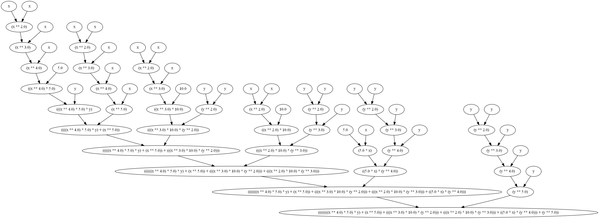
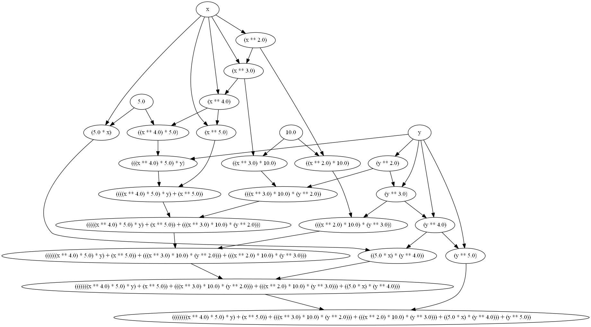

# Micro-TF

Крайне простая и неоптимизированная библиотека, которая пытается частично воспроизвести функционал tensorflow. В частности, естественный способ задания функций, упрощение выражений, нахождение производных, построение графа вычислений и его оптимизация.

Частично поддерживается forward-прогон с массивами numpy, но не тестировалось. Пример:

```
import numpy as np
import MTF

x = MTF.Input('x')
y = MTF.Input('y')

f = x * (y / 2)

print(f({x: np.arange(10), y: np.arange(10)}))
# Output: [ 0.   0.5  2.   4.5  8.  12.5 18.  24.5 32.  40.5]
```

# Пример построения графа бинома Ньютона.

Код:

```
from collections import namedtuple
from math import factorial
import MTF

def binomialCoef(n):
  nfact = factorial(n)
  return [nfact / (factorial(k) * factorial(n - k)) for k in range(n + 1)]

def generateBinomial(power):
  BinomPart = namedtuple('BinomialPart', ['coef', 'xpower', 'ypower'])
  coefs = binomialCoef(power)
  return [BinomPart(int(coef), xpower=power - k, ypower=k) for k, coef in enumerate(coefs)]
  
################################
x = MTF.Input('x')
y = MTF.Input('y')

power = 5
f = sum(
  B.coef * (x ** B.xpower) * (y ** B.ypower) for B in generateBinomial(power)
).simplify()

f.graph().toGraphViz().render('binom_raw.gv')
f.graph().optimize().toGraphViz().render('binom_optimized.gv')
```

Неоптимизированный граф выполнения:



Оптимизированный граф выполнения:



# Нахождение производной аналитической сигмоиды (без оптимизации)

```
import MTF

x = MTF.Input('x')
sigmoid = (1 + MTF.exp(-x)) ** -1

print('Formula: ', sigmoid())
print('Derivative: ', sigmoid.d().simplify()())

print()
print('Alternative')
sigmoid = 1. / (1 + MTF.exp(-x))
print('Formula: ', sigmoid())
print('Derivative: ', sigmoid.d().simplify()())
```

Вывод:

```
Formula:  ((1.0 + exp(-x)) ** -1.0)
Derivative:  (((1.0 + exp(-x)) ** -2.0) * exp(-x)) # same as exp(-x) / ((1.0 + exp(-x)) ** 2.0)

Alternative
Formula:  (1.0 / (1.0 + exp(-x)))
Derivative:  (exp(-x) / ((1.0 + exp(-x)) ** 2.0))
```
